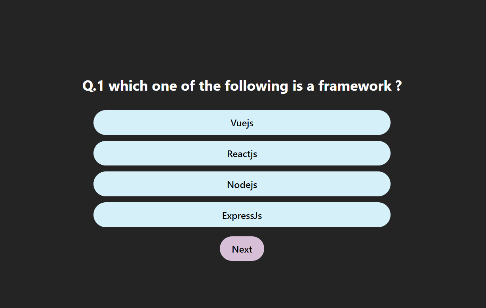

```markdown
# Quiz App

This is a simple quiz application built with React. Users can answer a series of multiple-choice questions and view their score at the end of the quiz.

## Features

- Multiple-choice questions
- Four options per question
- View score at the end of the quiz
- Navigation through questions using "Next" buttons

## Installation

To run this project locally, follow these steps:

1. Clone the repository:

   ```bash
   git clone https://github.com/md-faizan-khan61/quiz-app.git
   cd quiz-app
   ```

2. Install the dependencies:

   ```bash
   npm install
   ```

3. Start the development server:

   ```bash
   npm run dev
   ```

## Usage

Once the development server is running, open your browser and navigate to `http://localhost:3000` to view the quiz app. Answer the questions and navigate through them using the Next button. At the end of the quiz, you can view your score also.

## Technologies Used

- React
- Vite
- CSS for styling

## Screenshot



## Contributing

If you would like to contribute to this project, please fork the repository and submit a pull request. We appreciate your contributions!

## License

This project is licensed under the MIT License. See the [LICENSE](LICENSE) file for more details.
